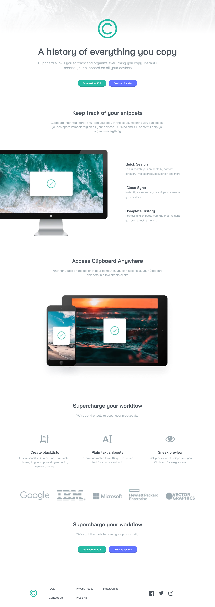
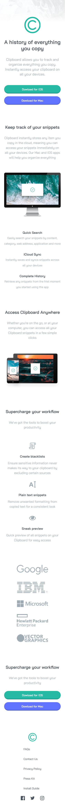

# Clipboard landing page

This is a solution to the [Clipboard landing page](https://www.frontendmentor.io/challenges/clipboard-landing-page-5cc9bccd6c4c91111378ecb9). 

[Frontend Mentor](https://www.frontendmentor.io) challenges help you improve your coding skills by building realistic projects.

## Table of contents

- [Clipboard landing page](#clipboard-landing-page)
  - [Table of contents](#table-of-contents)
  - [Overview](#overview)
    - [The challenge](#the-challenge)
    - [Screenshot](#screenshot)
    - [Links](#links)
  - [My process](#my-process)
    - [Built with](#built-with)
  - [Author](#author)

## Overview

### The challenge

Your challenge is to build out this landing page and get it looking as close to the design as possible.

You can use any tools you like to help you complete the challenge. So if you've got something you'd like to practice, feel free to give it a go.

Your users should be able to: 

- View the optimal layout for the site depending on their device's screen size
- See hover states for all interactive elements on the page

### Screenshot

desktop
 

 

mobile

### Links

- Solution URL: [Vercel hosting](https://clipboard-landing-mu.vercel.app/)

## My process

### Built with

- Mobile-first workflow
- [UnoCSS](https://github.com/unocss/unocss) - CSS framework
- [Vite](https://vitejs.dev/) - Frontend Tooling

## Author

- Frontend Mentor - [diversis](https://www.frontendmentor.io/profile/diversis)

